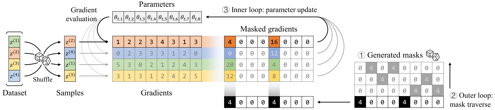
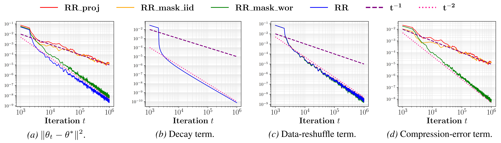
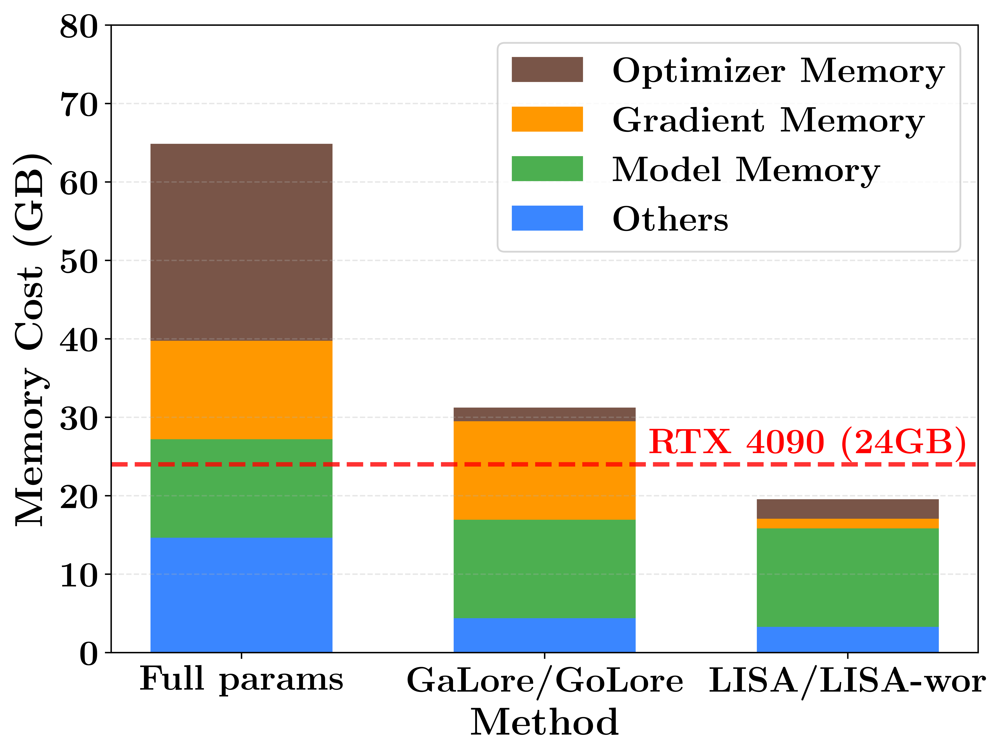

<h1 style="text-align: center;">Omni-Masked Gradient Descent: Memory-Efficient Optimization via Mask Traversal  with Improved Convergence</h1>

<div align="center">


</div>

# Overview
Memory-efficient optimization methods have recently gained increasing attention for scaling full-parameter training of large language models under the GPU-memory bottleneck. Existing approaches either lack clear convergence guarantees, or only achieve the standard ${\mathcal{O}}(\epsilon^{-4})$ iteration complexity in the nonconvex settings. We propose **O**mni-**M**asked **G**radient **D**escent (**OMGD**), an optimization method based on mask traversal for memory efficient training, and provide a nonconvex convergence analysis that establishes a strictly improved iteration complexity of $\tilde{\mathcal{O}}(\epsilon^{-3})$ for finding an $\epsilon$-approximate stationary point.  Empirically, OMGD is a lightweight, plug-and-play approach that integrates seamlessly into most mainstream optimizers, yielding consistent improvements over competitive baselines in both fine-tuning and pre-training tasks.

# Get Started
## Installation
```bash
conda create -n OMGD python=3.12 -y
conda activate OMGD
pip install -e .
pip install -r requirements.txt
```

## Illustrative example
Run the following code to reproduce the the result of the illustrative example:
```bash
cd ./examples/illustrative_example
python synthetic_data_training.py
```

<div align="center">
  
</div>


## Training
Use the provided scripts in `.vision_and_nlp/scripts/` to reproduce the results of image classification tasks and RoBERTafine-tuning.

For example, fine-tuning vision transformers on CIFAR-10:
```bash
cd ./examples/vision_and_nlp
bash ./scripts/fine-tuning_vit.sh
```

## Memory reduction
We evaluate GPU memory consumption of memory-efficient methods by pre-training a LLaMA-7B model on the C4 dataset using a single device.
<div align="left">
  
</div>

# Acknowledgements

- GPT-2 pre-training experiments are based on [`nanoGPT`](https://github.com/karpathy/nanoGPT).
- We thank [`Golore`](https://github.com/pkumelon/Golore) and [`SIFT`](https://github.com/song-wx/SIFT) for their open-source projects.

# Citation

If you find this work useful, please cite:

```bibtex
@misc{yang2026omnimaskedgradientdescentmemoryefficient,
      title={Omni-Masked Gradient Descent: Memory-Efficient Optimization via Mask Traversal with Improved Convergence}, 
      author={Hui Yang and Tao Ren and Jinyang Jiang and Wan Tian and Yijie Peng},
      year={2026},
      eprint={2603.05960},
      archivePrefix={arXiv},
      primaryClass={cs.LG},
      url={https://arxiv.org/abs/2603.05960}, 
}
=======
# OMGD
Official implementation of 'Omni-Masked Gradient Descent: Memory-Efficient Optimization via Mask Traversal with Improved Convergence'
>>>>>>> 6a1fdd9ef53c02d964988486f7c4f00eb7ddb98b
